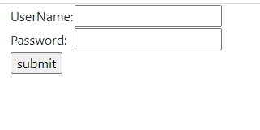
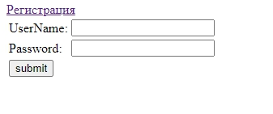
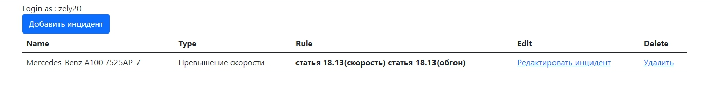
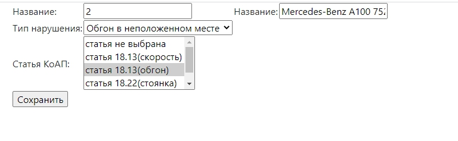

### Веб-приложение автонарушители

Описание приложения:

* Регистрация пользователя (Регистрация пользователя с одинаковым логином запрещена)

* Аутентификация пользователя

* Добавление нарушения

* Редактирование нарушения

* Удаление нарушения

---

Технологии:

* Spring (Core, MVC, Data, Security)

* Hibernate

* PostgreSQL

* Maven

* Apache Tomcat

* Jsp

* Travis CI

#### Registration page

#### Login page

#### Index page

#### Edit page

